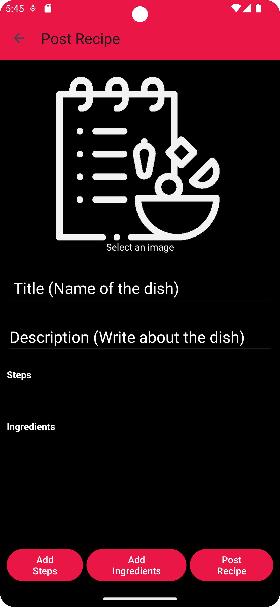
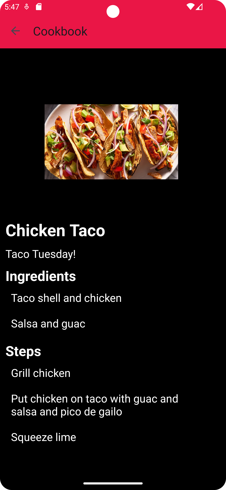
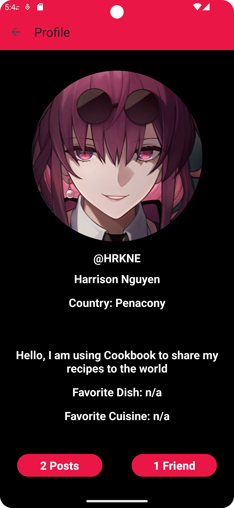
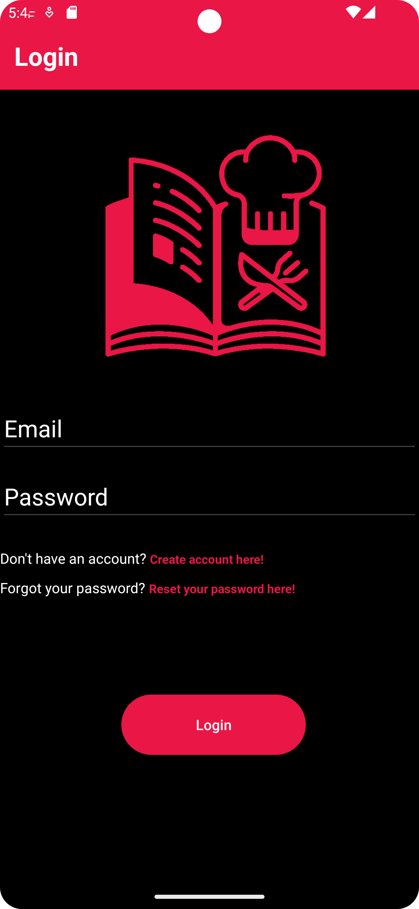

# About
  - Social networking android application that allows users to share recipes with other users online. The app was built using Java, Google Firebase, and XML.
  - This is my first Android app, so the app is still a work in progress and more features will be added alongside making the UI cleaner/consistent.

# Features
  - This app contains all the basic social media functions you would expect such as:
      - Creating an account with email, password, username, and profile picture
      - Posting recipes online with pictures, descriptions, ingredients, and steps
      - Edit all your recipes after posting them
      - Viewing all recipes from users, saving any recipes that catch your eye, and reviewing recipes to suggest improvements
      - Searching for recipes and users on the platform
      - Send friend requests and send messages between friends
   
# Screenshots

  
  
  
  
  

